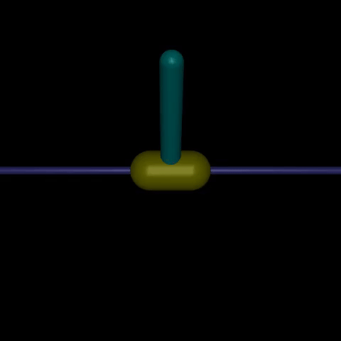
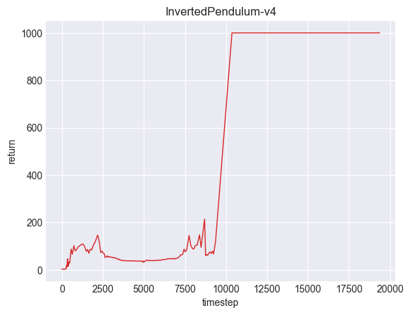
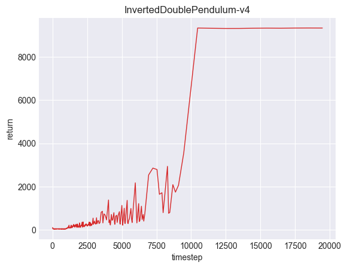
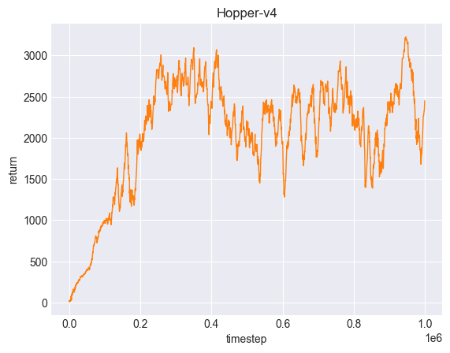
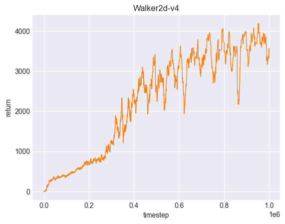

# Simple-RL

This repo offers straightforward implementations of reinforcement learning algorithms.
You can learn or test those algorithms easily.
We also provide several examples using Mujoco environments.


# Supporting Algorithms
- [PPO (Proximal Policy Optimization)](https://arxiv.org/pdf/1707.06347)
- [DDPG (Deep Deterministic Policy Gradient)](https://arxiv.org/pdf/1509.02971)

We'll be adding more algorithms soon. Stay tuned!


# Benchmark

### DDPG
| Capture | Training Return Curve |
| --- | --- |
|  |  |
|  |  |

### PPO
| Capture | Training Return Curve |
| --- | --- |
|  |  |
|  |  |


# Installation
```
pip install git+https://github.com/asdfGuest/Simple-RL.git
```


# Code Example
```python
from simple_rl import PPO
from stable_baselines3.common.env_util import make_vec_env

env = make_vec_env('Hopper-v4', n_envs=1)

model = PPO(env)
model.train(total_timesteps=1000000, verbose=1)

env.close()
```